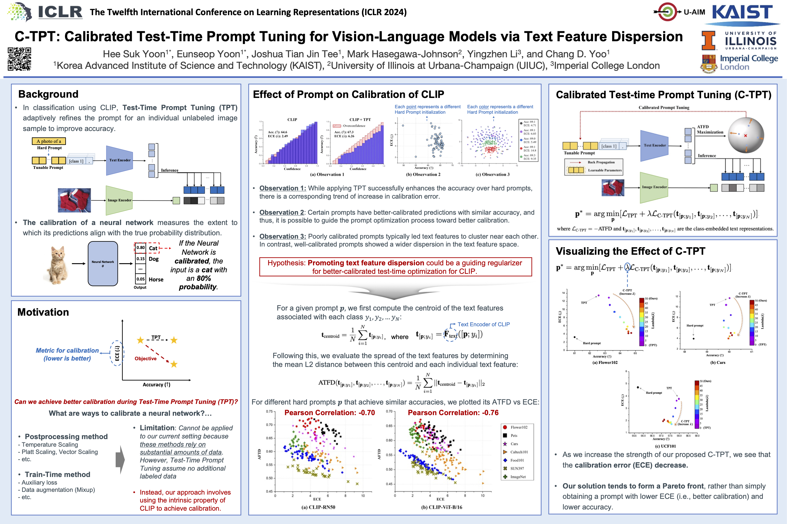

# C-TPT: Calibrated Test-Time Prompt Tuning for Vision-Language Models via Text Feature Dispersion (ICLR 2024)

This repository provides the official implementation of our ICLR 2024 paper:
> C-TPT: Calibrated Test-Time Prompt Tuning for Vision-Language Models via Text Feature Dispersion     
> Authors: Hee Suk Yoon*, Eunseop Yoon*, Joshua Tian Jin Tee, Mark Hasegawa-Johnson, Yingzhen Li, Chang D. Yoo

The implementation is built upon [TPT](https://github.com/azshue/TPT).

[[Paper Link](https://openreview.net/forum?id=jzzEHTBFOT)]



## Installation
```bash
# Clone this repo
git clone https://github.com/hee-suk-yoon/C-TPT
cd C-TPT

# Create a conda enviroment
1. conda env create -f environment.yml
2. conda activate ctpt
```

## Datasets
Our evaluation focuses on 

1) fine-grained classification: ImageNet, Flower102, OxfordPets, SUN397, DTD, Food101, StanfordCars, Aircraft, UCF101, EuroSAT, Caltech101

2) natural distribution shift: ImageNet-V2, ImageNet-A, ImageNet-R, ImageNet-Sketch

Prepare the datasets based on the following link https://github.com/azshue/TPT.

## Running Experiments

In each of the .sh files, change the {data_root} accordingly. Additionally, you can change the CLIP architecture by modifying the {arch} parameter to either ‘RN50’ or ‘ViT-B/16’.

1. Baseline (standard CLIP)
```bash
bash scripts/test_baseline.sh {dataset}
```

2. Test-Time Prompt Tuning (TPT)
```bash
#for Fine-grained classification
bash scripts/test_tpt_fg.sh {dataset}

#for natural distribution shift
bash scripts/test_tpt_ds.sh {dataset}

#for temperature scaling experiments, change the run_type to tpt_ts in the .sh file.
```

3. Calibrated Test-Time Prompt Tuning (C-TPT) 
```bash
#for Fine-grained classification
bash scripts/test_tpt_ctpt_fg.sh {dataset}

#for natural distribution shift
bash scripts/test_tpt_ctpt_ds.sh {dataset}
```
The command line argument {dataset} can be specified as follows: ‘I’, ‘DTD’, ‘Flower102’, ‘Food101’, ‘Cars’, ‘SUN397’, ‘Aircraft’, ‘Pets’, ‘Caltech101’, ‘UCF101’, or ‘eurosat’ for fine-grained classification datasets, and ‘V2’, ‘A’, ‘R’, or ‘K’ for datasets with natural distribution shifts.

## Acknowledgement
This work was supported by Institute of Information & communications Technology Planning & Evaluation (IITP) grant funded by the Korea government(MSIT) (No.2022-0-00184, Development and Study of AI Technologies to Inexpensively Conform to Evolving Policy on Ethics), and Institute of Information & communications Technology Planning & Evaluation (IITP) grant funded by the Korea government(MSIT) (No. 2022-0-00951, Development of Uncertainty-Aware Agents Learning by Asking Questions).

Also, we thank the authors of the [CoOp/CoCoOp](https://github.com/KaiyangZhou/CoOp) and [TPT](https://github.com/azshue/TPT) for their open-source contributions and their assistance with the data preparation.

## Citation
If you find our work useful in your research, please cite:
```
@inproceedings{
yoon2024ctpt,
title={C-{TPT}: Calibrated Test-Time Prompt Tuning for Vision-Language Models via Text Feature Dispersion},
author={Hee Suk Yoon and Eunseop Yoon and Joshua Tian Jin Tee and Mark A. Hasegawa-Johnson and Yingzhen Li and Chang D. Yoo},
booktitle={The Twelfth International Conference on Learning Representations},
year={2024},
url={https://openreview.net/forum?id=jzzEHTBFOT}
}
```

## Contact
If you have any questions, please feel free to email hskyoon@kaist.ac.kr
